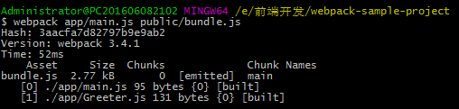
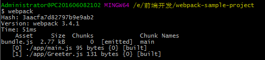
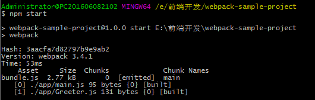

# 入门Webpack

## 1. 什么是webpack？

WebPack可以看做是**模块打包机**：它做的事情是，分析你的项目结构，找到JavaScript模块以及其它的一些浏览器不能直接运行的拓展语言（scss，TypeScript等），并将其打包为合适的格式以供浏览器使用。

## 2. webpack的工作方式

把项目当做一个整体，通过一个给定的主文件（如：main.js）, Webpack将从这个文件开始找到你的项目的所有依赖文件，使用loaders处理它们，最后打包为一个浏览器可识别的JavaScript文件（bundle.js）。

## 3. webpack初体验

### 3.1 安装

```
// 全局安装
npm install -g webpack
```

### 3.2 webpack使用（命令行方式）

- `npm init`   

  - 自动创建package.json文件。

- `npm install --save-dev webpack`

  - 在项目路径下安装webpack作为依赖包。

- `webpack {entry file} {destination for bundled file}`

  - 只需要指定一个入口文件，webpack将自动识别项目所依赖的其它文件，不过需要注意的是如果你的webpack没有进行全局安装，那么当你在终端中使用此命令时，需要额外指定其在node_modules中的地址。


  - `node_modules/.bin/webpack app/main.js public/bundle.js`  //webpack非全局安装的情况。

  - `webpack app/main.js public/bundle.js `   // 全局安装的情况。



- 如果在终端中进行复杂的操作，还是不太方便且容易出错。

### 3.3 Webpack使用（配置文件）

新建webpack.config.js文件，并进行简单的配置：

```
module.exports ={
  entry: __dirname + "/app/main.js",  //已多次提及的唯一入口文件
  output: {
    path: __dirname + "/public",      //打包后的文件存放的地方
    filename: "bundle.js"             //打包后输出文件的文件名
  }
}
```

> “__dirname”是node.js中的一个全局变量，它指向当前执行脚本所在的目录。

现在如果你需要打包文件只需要在终端里你运行 `webpack(非全局安装需使用node_modules/.bin/webpack)`命令就可以了，这条命令会自动参考webpack.config.js文件中的配置选项打包你的项目。



### 3.4 更快捷的执行打包任务

执行类似于 `node_modules/.bin/webpack`这样的命令其实是比较烦人且容易出错的，不过值得庆幸的是npm可以引导任务执行，对其进行配置后可以使用简单的 `npm start`命令来代替这些繁琐的命令。在package.json中对npm的脚本部分进行相关设置即可，设置方法如下：

```
{
  "name": "webpack-sample-project",
  "version": "1.0.0",
  "description": "",
  "main": "index.js",
  "scripts": {
    "test": "echo \"Error: no test specified\" && exit 1",
    "start": "webpack"  // 配置的地方就是这里，相当于把npm的start命令指向webpack命令
  },
  "author": "",
  "license": "ISC",
  "devDependencies": {
    "webpack": "^3.4.1"
  }
}
```

> package.json中的脚本部分已经默认在命令前添加了 `node_modules/.bin`路径，所以无论是全局还是局部安装的Webpack，你都不需要写前面那指明详细的路径了。

`npm`的 `start`是一个特殊的脚本名称，它的特殊性表现在，在命令行中使用 `npm start`就可以执行相关命令，如果对应的此脚本名称不是 `start`，想要在命令行中运行时，需要这样用 `npm run{script name}`如 `npm run build`。




